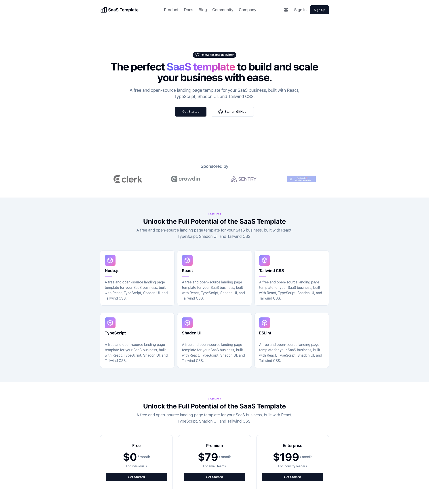
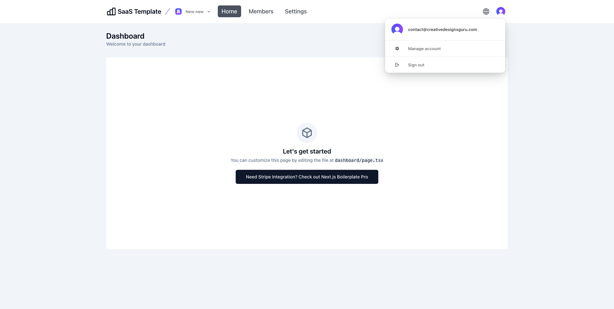
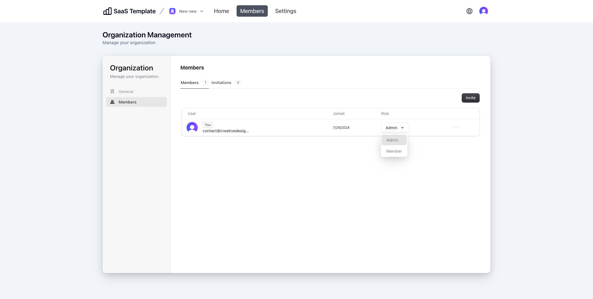
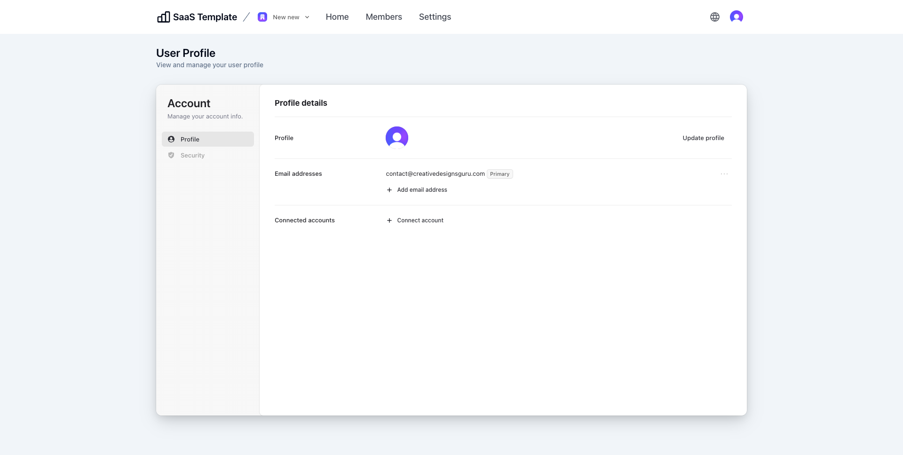
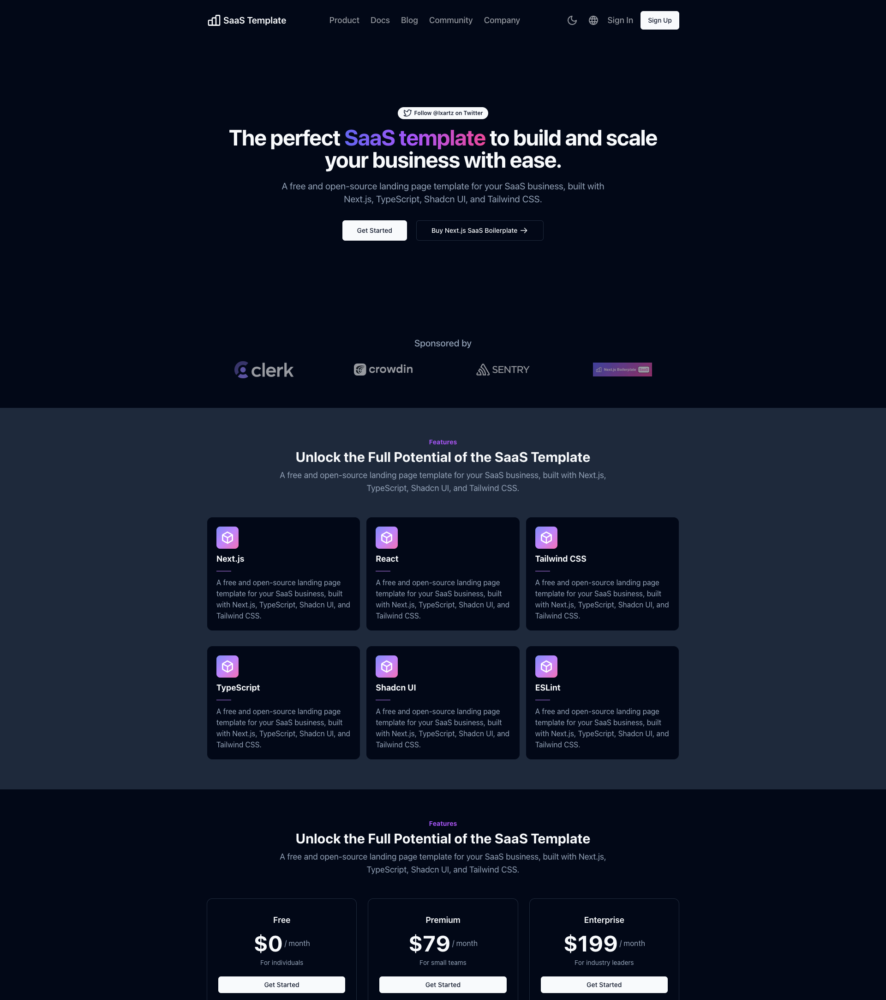
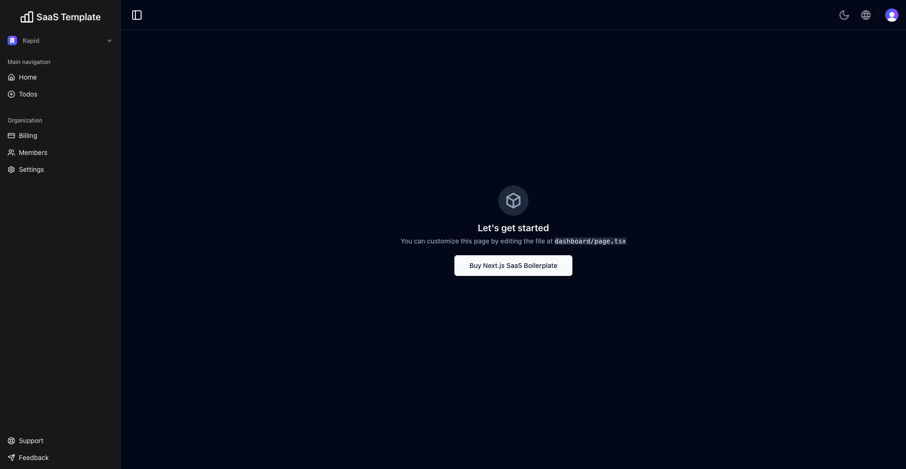
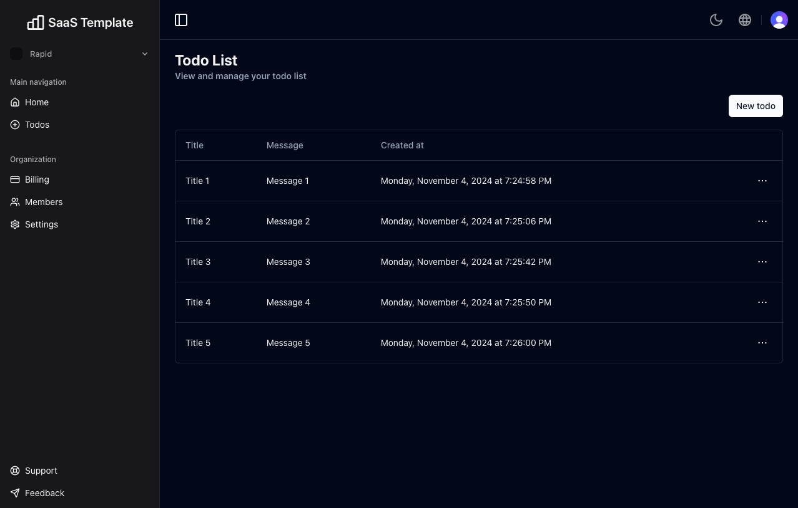

# Free and Open Source SaaS Boilerplate with Tailwind CSS and Shadcn UI

<p align="center">
  <a href="https://react-saas.com"></a>
</p>

🚀 **SaaS Boilerplate** is a powerful and fully customizable template to kickstart your SaaS applications. Built with **Next.js** and **Tailwind CSS**, and the modular UI components of **Shadcn UI**. This **Next.js SaaS Template** helps you to quickly build and launch SaaS with minimal effort.

Packed with essential features like built-in **Authentication**, **Multi-Tenancy** with Team support, **Role & Permission**, Database, I18n (internationalization), Landing Page, User Dashboard, Form handling, SEO optimization, Logging, Error reporting with [Sentry](https://sentry.io/for/nextjs/?utm_source=github&utm_medium=paid-community&utm_campaign=general-fy25q1-nextjs&utm_content=github-banner-nextjsboilerplate-logo), Testing, Deployment, Monitoring, and **User Impersonation**, this SaaS template provides everything you need to get started.

Designed with developers in mind, this **Next.js Starter Kit** uses TypeScript for type safety and integrates ESLint to maintain code quality, along with Prettier for consistent code formatting. The testing suite combines Vitest and React Testing Library for robust unit testing, while Playwright handles integration and E2E testing. Continuous integration and deployment are managed via GitHub Actions. For user management, authentication is handled by [Clerk](https://go.clerk.com/zGlzydF). For database operations, it uses Drizzle ORM for type-safe database management across popular databases like PostgreSQL, SQLite, and MySQL. One recommended option is to use [Prisma PostgreSQL](https://www.prisma.io/?via=saasboilerplatetop), which provides a free PostgreSQL database that is compatible and has been tested with SaaS Boilerplate.

Whether you're building a new SaaS app or looking for a flexible, **production-ready SaaS template**, this boilerplate has you covered. This free, open-source starter kit has everything you need to accelerate your development and scale your product with ease.

Clone this project and use it to create your own SaaS. You can check the live demo at [SaaS Boilerplate](https://react-saas.com), which is a demo with a working authentication and multi-tenancy system.

## Sponsors

<table width="100%">
  <tr height="187px">
    <td align="center" width="33%">
      <a href="https://go.clerk.com/zGlzydF">
        <picture>
          <source media="(prefers-color-scheme: dark)" srcset="https://github.com/ixartz/SaaS-Boilerplate/assets/1328388/6fb61971-3bf1-4580-98a0-10bd3f1040a2">
          <source media="(prefers-color-scheme: light)" srcset="https://github.com/ixartz/SaaS-Boilerplate/assets/1328388/f80a8bb5-66da-4772-ad36-5fabc5b02c60">
          
        </picture>
      </a>
    </td>
    <td align="center" width="33%">
      <a href="https://www.coderabbit.ai?utm_source=next_js_starter&utm_medium=github&utm_campaign=next_js_starter_oss_2025">
        <picture>
          <source media="(prefers-color-scheme: dark)" srcset="public/assets/images/coderabbit-logo-dark.svg?raw=true">
          <source media="(prefers-color-scheme: light)" srcset="public/assets/images/coderabbit-logo-light.svg?raw=true">
          
        </picture>
      </a>
    </td>
    <td align="center" width="33%">
      <a href="https://sentry.io/for/nextjs/?utm_source=github&utm_medium=paid-community&utm_campaign=general-fy25q1-nextjs&utm_content=github-banner-nextjsboilerplate-logo">
        <picture>
          <source media="(prefers-color-scheme: dark)" srcset="public/assets/images/sentry-white.png?raw=true">
          <source media="(prefers-color-scheme: light)" srcset="public/assets/images/sentry-dark.png?raw=true">
          
        </picture>
      </a>
      <a href="https://about.codecov.io/codecov-free-trial/?utm_source=github&utm_medium=paid-community&utm_campaign=general-fy25q1-nextjs&utm_content=github-banner-nextjsboilerplate-logo">
        <picture>
          <source media="(prefers-color-scheme: dark)" srcset="public/assets/images/codecov-white.svg?raw=true">
          <source media="(prefers-color-scheme: light)" srcset="public/assets/images/codecov-dark.svg?raw=true">
          
        </picture>
      </a>
    </td>
  </tr>
  <tr height="187px">
    <td align="center" width="33%">
      <a href="https://launch.arcjet.com/Q6eLbRE">
        <picture>
          <source media="(prefers-color-scheme: dark)" srcset="public/assets/images/arcjet-dark.svg?raw=true">
          <source media="(prefers-color-scheme: light)" srcset="public/assets/images/arcjet-light.svg?raw=true">
          
        </picture>
      </a>
    </td>
    <td align="center" width="33%">
      <a href="https://l.crowdin.com/next-js">
        <picture>
          <source media="(prefers-color-scheme: dark)" srcset="public/assets/images/crowdin-white.png?raw=true">
          <source media="(prefers-color-scheme: light)" srcset="public/assets/images/crowdin-dark.png?raw=true">
          
        </picture>
      </a>
    </td>
    <td align="center" style=width="33%">
      <a href="https://nextjs-boilerplate.com/pro-saas-starter-kit">
        
      </a>
    </td>
  </tr>
  <tr height="187px">
    <td align="center" width="33%">
      <a href="https://www.nutrient.io/guides/web/nextjs/?utm_source=nextjs-boilerplate&utm_medium=referral">
        <picture>
          <source media="(prefers-color-scheme: dark)" srcset="public/assets/images/nutrient-dark.png?raw=true">
          <source media="(prefers-color-scheme: light)" srcset="public/assets/images/nutrient-light.png?raw=true">
          
        </picture>
      </a>
    </td>
    <td align="center" width="33%">
      <a href="mailto:contact@creativedesignsguru.com">
        Add your logo here
      </a>
    </td>
  </tr>
</table>

### Demo

**Live demo: [SaaS Boilerplate](https://react-saas.com)**

| Landing Page | User Dashboard |
| --- | --- |
| [](https://react-saas.com) | [](https://react-saas.com/dashboard) |

| Team Management | User Profile |
| --- | --- |
| [](https://react-saas.com/dashboard/organization-profile/organization-members) | [](https://react-saas.com/dashboard/user-profile) |

| Sign Up | Sign In |
| --- | --- |
| [](https://react-saas.com/sign-up) | [](https://react-saas.com/sign-in) |

| Landing Page with Dark Mode (Pro Version) | User Dashboard with Dark Mode (Pro Version) |
| --- | --- |
| [](https://pro-demo.nextjs-boilerplate.com) | [](https://pro-demo.nextjs-boilerplate.com/dashboard) |

| User Dashboard with Sidebar (Pro Version) |
| --- |
| [](https://pro-demo.nextjs-boilerplate.com) |

### Features

Developer experience first, extremely flexible code structure and only keep what you need:

- ⚡ [Next.js](https://nextjs.org) with App Router support
- 🔥 Type checking [TypeScript](https://www.typescriptlang.org)
- 💎 Integrate with [Tailwind CSS](https://tailwindcss.com) and Shadcn UI
- ✅ Strict Mode for TypeScript and [React](https://react.dev)
- 🔒 Authentication with [Clerk](https://go.clerk.com/zGlzydF): Sign up, Sign in, Sign out, Forgot password, Reset password, and more.
- 👤 Passwordless Authentication with Magic Links, Multi-Factor Auth (MFA), Social Auth (Google, Facebook, Twitter, GitHub, Apple, and more), Passwordless login with Passkeys, User Impersonation
- 👥 Multi-tenancy & team support: create, switch, update organization and invite team members
- 📝 Role-based access control and permissions
- 👤 Multi-Factor Auth (MFA), Social Auth (Google, Facebook, Twitter, GitHub, Apple, and more), User Impersonation
- 📦 Type-safe ORM with DrizzleORM, compatible with PostgreSQL, SQLite, and MySQL
- 💽 Offline and local development database with PGlite
- ☁️ Remote and production database with [Prisma Postgres](https://www.prisma.io/?via=saasboilerplate)
- 🌐 Multi-language (i18n) with [next-intl](https://next-intl-docs.vercel.app/) and [Crowdin](https://l.crowdin.com/next-js)
- ♻️ Type-safe environment variables with T3 Env
- ⌨️ Form with [React Hook Form](https://react-hook-form.com)
- 🔴 Validation library with [Zod](https://zod.dev)
- 📏 Linter with [ESLint](https://eslint.org) (default NextJS, NextJS Core Web Vitals, Tailwind CSS and Antfu configuration)
- 💖 Code Formatter with [Prettier](https://prettier.io)
- 🦊 Husky for Git Hooks
- 🚫 Lint-staged for running linters on Git staged files
- 🚓 Lint git commit with Commitlint
- 📓 Write standard compliant commit messages with Commitizen
- 🦺 Unit Testing with [Vitest](https://vitest.dev) and React Testing Library
- 🧪 Integration and E2E Testing with [Playwright](https://playwright.dev)
- 👷 Run tests on pull requests with GitHub Actions
- 🎉 [Storybook](https://storybook.js.org) for UI development
- 🚨 Error Monitoring with [Sentry](https://sentry.io/for/nextjs/?utm_source=github&utm_medium=paid-community&utm_campaign=general-fy25q1-nextjs&utm_content=github-banner-nextjsboilerplate-logo)
- ☂️ Code coverage with [Codecov](https://about.codecov.io/codecov-free-trial/?utm_source=github&utm_medium=paid-community&utm_campaign=general-fy25q1-nextjs&utm_content=github-banner-nextjsboilerplate-logo)
- 📝 Logging with [Pino.js](https://getpino.io) and Log Management with [Better Stack](https://betterstack.com/?utm_source=github&utm_medium=sponsorship&utm_campaign=next-js-boilerplate)
- 🖥️ Monitoring as Code with [Checkly](https://www.checklyhq.com/?utm_source=github&utm_medium=sponsorship&utm_campaign=next-js-boilerplate)
- 🎁 Automatic changelog generation with Semantic Release
- 🔍 Visual testing with Percy (Optional)
- 💡 Absolute Imports using `@` prefix
- 🗂 VSCode configuration: Debug, Settings, Tasks and Extensions
- 🤖 SEO metadata, JSON-LD and Open Graph tags
- 🗺️ Sitemap.xml and robots.txt
- ⌘ Database exploration with Drizzle Studio and CLI migration tool with Drizzle Kit
- ⚙️ [Bundler Analyzer](https://www.npmjs.com/package/@next/bundle-analyzer)
- 🌈 Include a FREE minimalist theme
- 💯 Maximize lighthouse score

Built-in feature from Next.js:

- ☕ Minify HTML & CSS
- 💨 Live reload
- ✅ Cache busting

### Philosophy

- Nothing is hidden from you, allowing you to make any necessary adjustments to suit your requirements and preferences.
- Dependencies are updated every month
- Start for free without upfront costs
- Easy to customize
- Minimal code
- SEO-friendly
- Everything you need to build a SaaS
- 🚀 Production-ready

### Requirements

- Node.js 20+ and npm

### Getting started

Run the following command on your local environment:

```shell
git clone --depth=1 https://github.com/ixartz/SaaS-Boilerplate.git my-project-name
cd my-project-name
npm install
```

For your information, all dependencies are updated every month.

Then, you can run the project locally in development mode with live reload by executing:

```shell
npm run dev
```

[](https://go.warp.dev/nextjs-bp)

Open http://localhost:3000 with your favorite browser to see your project.

### Free vs Pro version

This project offers both a free open-source version and a premium Pro version. Here's a detailed comparison:

| Features | Free Version | Pro Version |
|---------|:------------:|:-----------:|
| **Authentication** | ✅ | ✅ |
| **Social Login (Google, Facebook, GitHub, etc.)** | ✅ | ✅ |
| **Multi-Factor Auth & User Impersonation** | ✅ | ✅ |
| **Multi-tenancy & Team Support** | ✅ | ✅ |
| **Role-based Access Control (RBAC)** | ✅ | ✅ |
| **Landing Page (Hero, Features, Pricing)** | ✅ | ✅ |
| **Internationalization (i18n)** | ✅ | ✅ |
| **Drizzle ORM & Dev Database** | ✅ | ✅ |
| **GitHub Actions** | ✅ | ✅ |
| **VSCode Configuration** | ✅ | ✅ |
| **[Sentry Error Monitoring](https://sentry.io/for/nextjs/?utm_source=github&utm_medium=paid-community&utm_campaign=general-fy25q1-nextjs&utm_content=github-banner-nextjsboilerplate-logo)** | ✅ | ✅ |
| **Shadcn UI** | ✅ | ✅ |
| **Next.js** | 14 | 15 |
| **React** | 18 | 19 |
| **Tailwind CSS** | 3 | 4 |
| **ESLint** | 8 | 9 |
| **User Dashboard** | Basic | Extended |
| **Code Quality Tools** | Basic | Extended |
| **Testing: Unit, Integration, E2E, Visual** | Basic | Extended |
| **Stripe Integration** | ❌ | ✅ |
| **Todo App Example (CRUD)** | ❌ | ✅ |
| **End-to-End Typesafe APIs (oRPC)** | ❌ | ✅ |
| **Dark Mode** | ❌ | ✅ |
| **Latest version** | ❌ | ✅ |
| **Email support (1 year)** | ❌ | ✅ |

**Live Demos:**
- Free Version: [https://react-saas.com](https://react-saas.com)
- Pro Version: [https://pro-demo.nextjs-boilerplate.com](https://pro-demo.nextjs-boilerplate.com)

**Note:** Some differences like Next.js 15/React 19 and Tailwind CSS 4 are currently temporary as the free version will eventually be updated. However, Pro version users always get access to the latest version first.

### Set up authentication

Create a Clerk account at [Clerk.com](https://go.clerk.com/zGlzydF) and create a new application in the Clerk Dashboard. Then, copy the values of `NEXT_PUBLIC_CLERK_PUBLISHABLE_KEY` and `CLERK_SECRET_KEY` into the `.env.local` file (which is not tracked by Git):

```shell
NEXT_PUBLIC_CLERK_PUBLISHABLE_KEY=your_clerk_pub_key
CLERK_SECRET_KEY=your_clerk_secret_key
```

In your Clerk Dashboard, you also need to `Enable Organization` by navigating to `Organization management` > `Settings` > `Enable organization`.

Now, you have a fully working authentication system with Next.js: Sign up, Sign in, Sign out, Forgot password, Reset password, Update profile, Update password, Update email, Delete account, and more.

### Set up remote database

The project uses DrizzleORM, a type-safe ORM that is compatible with PostgreSQL, SQLite, and MySQL databases. By default, the project is set up to work seamlessly with PostgreSQL and you can easily choose any PostgreSQL database provider.

To set up a remote and production database, you need to create a PostgreSQL database and obtain the connection string. One recommended option is to use [Prisma PostgreSQL](https://www.prisma.io/?via=saasboilerplate), which provides a free PostgreSQL database. This database is compatible and has been tested with Next.js Boilerplate.

After creating your Prisma account, you can get the connection string in the `Connect to your database` section and select the `Any client` tab. Then, you can generate the connection string by clicking the `Generate database credentials` button. Finally, you can copy the connection string and add the `DATABASE_URL` variable to the `.env.local` file.

### Translation (i18n) setup

For translation, the project uses `next-intl` combined with [Crowdin](https://l.crowdin.com/next-js). As a developer, you only need to take care of the English (or another default language) version. Translations for other languages are automatically generated and handled by Crowdin. You can use Crowdin to collaborate with your translation team or translate the messages yourself with the help of machine translation.

To set up translation (i18n), create an account at [Crowdin.com](https://l.crowdin.com/next-js) and create a new project. In the newly created project, you will be able to find the project ID. You will also need to create a new Personal Access Token by going to Account Settings > API. Then, in your GitHub Actions, you need to define the following environment variables: `CROWDIN_PROJECT_ID` and `CROWDIN_PERSONAL_TOKEN`.

After defining the environment variables in your GitHub Actions, your localization files will be synchronized with Crowdin every time you push a new commit to the `main` branch.

### Project structure

```shell
.
├── README.md                       # README file
├── .github                         # GitHub folder
├── .husky                          # Husky configuration
├── .storybook                      # Storybook folder
├── .vscode                         # VSCode configuration
├── migrations                      # Database migrations
├── public                          # Public assets folder
├── scripts                         # Scripts folder
├── src
│   ├── app                         # Next JS App (App Router)
│   ├── components                  # Reusable components
│   ├── features                    # Components specific to a feature
│   ├── libs                        # 3rd party libraries configuration
│   ├── locales                     # Locales folder (i18n messages)
│   ├── models                      # Database models
│   ├── styles                      # Styles folder
│   ├── templates                   # Templates folder
│   ├── types                       # Type definitions
│   └── utils                       # Utilities folder
├── tests
│   ├── e2e                         # E2E tests, also includes Monitoring as Code
│   └── integration                 # Integration tests
├── tailwind.config.js              # Tailwind CSS configuration
└── tsconfig.json                   # TypeScript configuration
```

### Customization

You can easily configure Next.js SaaS Boilerplate by searching the entire project for `FIXME:` to make quick customization. Here are some of the most important files to customize:

- `public/apple-touch-icon.png`, `public/favicon.ico`, `public/favicon-16x16.png` and `public/favicon-32x32.png`: your website favicon
- `src/utils/AppConfig.ts`: configuration file
- `src/templates/BaseTemplate.tsx`: default theme
- `next.config.mjs`: Next.js configuration
- `.env`: default environment variables

You have full access to the source code for further customization. The provided code is just an example to help you start your project. The sky's the limit 🚀.

In the source code, you will also find `PRO` comments that indicate the code that is only available in the PRO version. You can easily remove or replace this code with your own implementation.

### Change database schema

To modify the database schema in the project, you can update the schema file located at `./src/models/Schema.ts`. This file defines the structure of your database tables using the Drizzle ORM library.

After making changes to the schema, generate a migration by running the following command:

```shell
npm run db:generate
```

[](https://go.warp.dev/nextjs-bp)

This will create a migration file that reflects your schema changes. The migration is automatically applied during the next database interaction, so there is no need to run it manually or restart the Next.js server.

### Commit Message Format

The project follows the [Conventional Commits](https://www.conventionalcommits.org/) specification, meaning all commit messages must be formatted accordingly. To help you write commit messages, the project uses [Commitizen](https://github.com/commitizen/cz-cli), an interactive CLI that guides you through the commit process. To use it, run the following command:

```shell
npm run commit
```

One of the benefits of using Conventional Commits is the ability to automatically generate a `CHANGELOG` file. It also allows us to automatically determine the next version number based on the types of commits that are included in a release.

### Subscription payment with Stripe

The project is integrated with Stripe for subscription payment. You need to create a Stripe account and you also need to install the Stripe CLI. After installing the Stripe CLI, you need to login using the CLI:

```shell
stripe login
```

Then, you can run the following command to create a new price:

```shell
npm run stripe:setup-price
```

After running the command, you need to copy the price ID and paste it in `src/utils/AppConfig.ts` by updating the existing price ID with the new one.

In your Stripe Dashboard, you are required to configure your customer portal settings at https://dashboard.stripe.com/test/settings/billing/portal. Most importantly, you need to save the settings.

In your `.env` file, you need to update the `NEXT_PUBLIC_STRIPE_PUBLISHABLE_KEY` with your own Stripe Publishable key. You can find the key in your Stripe Dashboard. Then, you also need to create a new file named `.env.local` and add the following environment variables in the newly created file:

```shell
STRIPE_SECRET_KEY=your_stripe_secret_key
STRIPE_WEBHOOK_SECRET=your_stripe_webhook_secret
```

You get the `STRIPE_SECRET_KEY` from your Stripe Dashboard. The `STRIPE_WEBHOOK_SECRET` is generated by running the following command:

```shell
npm run dev
```

You'll find in your terminal the webhook signing secret. You can copy it and paste it in your `.env.local` file.

### Testing

All unit tests are located alongside the source code in the same directory, making them easier to find. The project uses Vitest and React Testing Library for unit testing. You can run the tests with the following command:

```shell
npm run test
```

[](https://go.warp.dev/nextjs-bp)

### Integration & E2E Testing

The project uses Playwright for integration and end-to-end (E2E) testing. You can run the tests with the following commands:

```shell
npx playwright install # Only for the first time in a new environment
npm run test:e2e
```

In the local environment, visual testing is disabled, and the terminal will display the message `[percy] Percy is not running, disabling snapshots.`. By default, visual testing only runs in GitHub Actions.

### Enable Edge runtime (optional)

The App Router folder is compatible with the Edge runtime. You can enable it by adding the following lines `src/app/layouts.tsx`:

```tsx
export const runtime = 'edge';
```

For your information, the database migration is not compatible with the Edge runtime. So, you need to disable the automatic migration in `src/libs/DB.ts`:

```tsx
await migrate(db, { migrationsFolder: './migrations' });
```

After disabling it, you are required to run the migration manually with:

```shell
npm run db:migrate
```

You also require to run the command each time you want to update the database schema.

### Deploy to production

During the build process, database migrations are automatically executed, so there's no need to run them manually. However, you must define `DATABASE_URL` in your environment variables.

Then, you can generate a production build with:

```shell
$ npm run build
```

[](https://go.warp.dev/nextjs-bp)

It generates an optimized production build of the boilerplate. To test the generated build, run:

```shell
$ npm run start
```

You also need to defined the environment variables `CLERK_SECRET_KEY` using your own key.

This command starts a local server using the production build. You can now open http://localhost:3000 in your preferred browser to see the result.

### Error Monitoring

The project uses [Sentry](https://sentry.io/for/nextjs/?utm_source=github&utm_medium=paid-community&utm_campaign=general-fy25q1-nextjs&utm_content=github-banner-nextjsboilerplate-logo) to monitor errors. In the development environment, no additional setup is needed: NextJS SaaS Boilerplate is pre-configured to use Sentry and Spotlight (Sentry for Development). All errors will automatically be sent to your local Spotlight instance, allowing you to experience Sentry locally.

For production environment, you'll need to create a Sentry account and a new project. Then, in `next.config.mjs`, you need to update the `org` and `project` attributes in `withSentryConfig` function. Additionally, add your Sentry DSN to `sentry.client.config.ts`, `sentry.edge.config.ts` and `sentry.server.config.ts`.

### Code coverage

Next.js SaaS Template relies on [Codecov](https://about.codecov.io/codecov-free-trial/?utm_source=github&utm_medium=paid-community&utm_campaign=general-fy25q1-nextjs&utm_content=github-banner-nextjsboilerplate-logo) for code coverage reporting solution. To enable Codecov, create a Codecov account and connect it to your GitHub account. Your repositories should appear on your Codecov dashboard. Select the desired repository and copy the token. In GitHub Actions, define the `CODECOV_TOKEN` environment variable and paste the token.

Make sure to create `CODECOV_TOKEN` as a GitHub Actions secret, do not paste it directly into your source code.

### Logging

The project uses Pino.js for logging. In the development environment, logs are displayed in the console by default.

For production, the project is already integrated with [Better Stack](https://betterstack.com/?utm_source=github&utm_medium=sponsorship&utm_campaign=next-js-boilerplate) to manage and query your logs using SQL. To use Better Stack, you need to create a [Better Stack](https://betterstack.com/?utm_source=github&utm_medium=sponsorship&utm_campaign=next-js-boilerplate) account and create a new source: go to your Better Stack Logs Dashboard > Sources > Connect source. Then, you need to give a name to your source and select Node.js as the platform.

After creating the source, you will be able to view and copy your source token. In your environment variables, paste the token into the `LOGTAIL_SOURCE_TOKEN` variable. Now, all logs will automatically be sent to and ingested by Better Stack.

### Checkly monitoring

The project uses [Checkly](https://www.checklyhq.com/?utm_source=github&utm_medium=sponsorship&utm_campaign=next-js-boilerplate) to ensure that your production environment is always up and running. At regular intervals, Checkly runs the tests ending with `*.check.e2e.ts` extension and notifies you if any of the tests fail. Additionally, you have the flexibility to execute tests from multiple locations to ensure that your application is available worldwide.

To use Checkly, you must first create an account on [their website](https://www.checklyhq.com/?utm_source=github&utm_medium=sponsorship&utm_campaign=next-js-boilerplate). After creating an account, generate a new API key in the Checkly Dashboard and set the `CHECKLY_API_KEY` environment variable in GitHub Actions. Additionally, you will need to define the `CHECKLY_ACCOUNT_ID`, which can also be found in your Checkly Dashboard under User Settings > General.

To complete the setup, update the `checkly.config.ts` file with your own email address and production URL.

### Useful commands

#### Bundle Analyzer

Next.js SaaS Starter Kit includes a built-in bundle analyzer. It can be used to analyze the size of your JavaScript bundles. To begin, run the following command:

```shell
npm run build-stats
```

By running the command, it'll automatically open a new browser window with the results.

#### Database Studio

The project is already configured with Drizzle Studio to explore the database. You can run the following command to open the database studio:

```shell
npm run db:studio
```

Then, you can open https://local.drizzle.studio with your favorite browser to explore your database.

### VSCode information (optional)

If you are VSCode user, you can have a better integration with VSCode by installing the suggested extension in `.vscode/extension.json`. The starter code comes up with Settings for a seamless integration with VSCode. The Debug configuration is also provided for frontend and backend debugging experience.

With the plugins installed in your VSCode, ESLint and Prettier can automatically fix the code and display errors. The same applies to testing: you can install the VSCode Vitest extension to automatically run your tests, and it also shows the code coverage in context.

Pro tips: if you need a project wide-type checking with TypeScript, you can run a build with <kbd>Cmd</kbd> + <kbd>Shift</kbd> + <kbd>B</kbd> on Mac.

### Contributions

Everyone is welcome to contribute to this project. Feel free to open an issue if you have any questions or find a bug. Totally open to suggestions and improvements.

### License

Licensed under the MIT License, Copyright © 2024

See [LICENSE](LICENSE) for more information.

## Sponsors

<table width="100%">
  <tr height="187px">
    <td align="center" width="33%">
      <a href="https://go.clerk.com/zGlzydF">
        <picture>
          <source media="(prefers-color-scheme: dark)" srcset="https://github.com/ixartz/SaaS-Boilerplate/assets/1328388/6fb61971-3bf1-4580-98a0-10bd3f1040a2">
          <source media="(prefers-color-scheme: light)" srcset="https://github.com/ixartz/SaaS-Boilerplate/assets/1328388/f80a8bb5-66da-4772-ad36-5fabc5b02c60">
          
        </picture>
      </a>
    </td>
    <td align="center" width="33%">
      <a href="https://www.coderabbit.ai?utm_source=next_js_starter&utm_medium=github&utm_campaign=next_js_starter_oss_2025">
        <picture>
          <source media="(prefers-color-scheme: dark)" srcset="public/assets/images/coderabbit-logo-dark.svg?raw=true">
          <source media="(prefers-color-scheme: light)" srcset="public/assets/images/coderabbit-logo-light.svg?raw=true">
          
        </picture>
      </a>
    </td>
    <td align="center" width="33%">
      <a href="https://sentry.io/for/nextjs/?utm_source=github&utm_medium=paid-community&utm_campaign=general-fy25q1-nextjs&utm_content=github-banner-nextjsboilerplate-logo">
        <picture>
          <source media="(prefers-color-scheme: dark)" srcset="public/assets/images/sentry-white.png?raw=true">
          <source media="(prefers-color-scheme: light)" srcset="public/assets/images/sentry-dark.png?raw=true">
          
        </picture>
      </a>
      <a href="https://about.codecov.io/codecov-free-trial/?utm_source=github&utm_medium=paid-community&utm_campaign=general-fy25q1-nextjs&utm_content=github-banner-nextjsboilerplate-logo">
        <picture>
          <source media="(prefers-color-scheme: dark)" srcset="public/assets/images/codecov-white.svg?raw=true">
          <source media="(prefers-color-scheme: light)" srcset="public/assets/images/codecov-dark.svg?raw=true">
          
        </picture>
      </a>
    </td>
  </tr>
  <tr height="187px">
    <td align="center" width="33%">
      <a href="https://launch.arcjet.com/Q6eLbRE">
        <picture>
          <source media="(prefers-color-scheme: dark)" srcset="public/assets/images/arcjet-dark.svg?raw=true">
          <source media="(prefers-color-scheme: light)" srcset="public/assets/images/arcjet-light.svg?raw=true">
          
        </picture>
      </a>
    </td>
    <td align="center" width="33%">
      <a href="https://l.crowdin.com/next-js">
        <picture>
          <source media="(prefers-color-scheme: dark)" srcset="public/assets/images/crowdin-white.png?raw=true">
          <source media="(prefers-color-scheme: light)" srcset="public/assets/images/crowdin-dark.png?raw=true">
          
        </picture>
      </a>
    </td>
    <td align="center" style=width="33%">
      <a href="https://nextjs-boilerplate.com/pro-saas-starter-kit">
        
      </a>
    </td>
  </tr>
  <tr height="187px">
    <td align="center" width="33%">
      <a href="https://www.nutrient.io/guides/web/nextjs/?utm_source=nextjs-boilerplate&utm_medium=referral">
        <picture>
          <source media="(prefers-color-scheme: dark)" srcset="public/assets/images/nutrient-dark.png?raw=true">
          <source media="(prefers-color-scheme: light)" srcset="public/assets/images/nutrient-light.png?raw=true">
          
        </picture>
      </a>
    </td>
    <td align="center" width="33%">
      <a href="mailto:contact@creativedesignsguru.com">
        Add your logo here
      </a>
    </td>
  </tr>
</table>

---

Made with ♥ by [CreativeDesignsGuru](https://creativedesignsguru.com) [](https://twitter.com/ixartz)

Looking for a custom boilerplate to kick off your project? I'd be glad to discuss how I can help you build one. Feel free to reach out anytime at contact@creativedesignsguru.com!

[](https://github.com/sponsors/ixartz)
